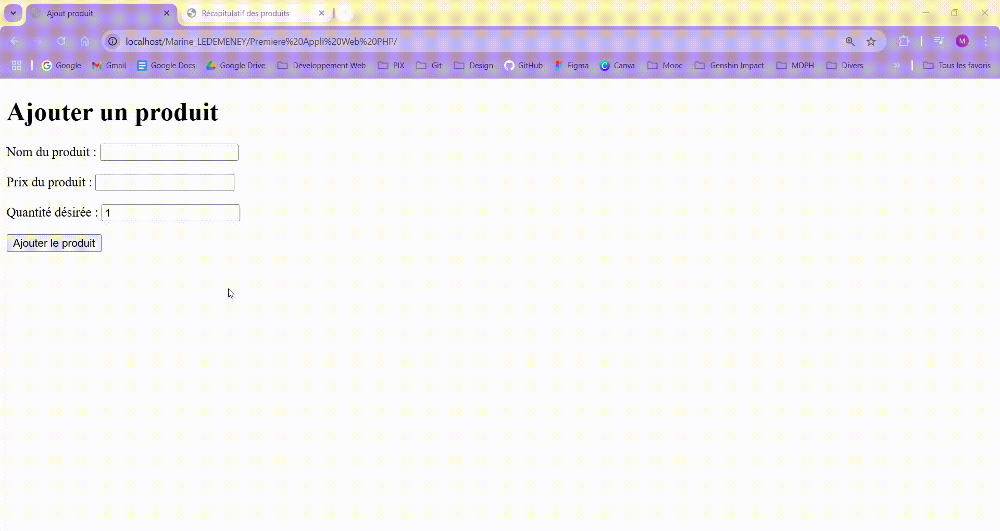

# Ma Première Application Web en PHP 💻 #
## - Exercice guidé avec un cahier des charges à respecter - ##

 

### Objectifs : ###
***Réaliser l'exercice guidé avec un cahier des charges à respecter.***

  

### Cahier des Charges : ###

> [!IMPORTANT]
> L'application doit permettre à un utilisateur de renseigner différents produits par le biais d'un formulaire, produits qui seront consultables sur une page récapitulative.
> 
>L'enregistrement  en  session  de  chaque  produit  est  nécessaire.
> 
>L'application  ne nécessite pour l'instant aucun rendu visuel spécifique.

Trois pages sont nécessaires à cela :

1. index.php

    Présentera un formulaire permettant de renseigner :
    <ul>
        <li>Le nom du produit</li>
        <li>Son prix unitaire</li>
        <li>La quantité désirée.</li>
    </ul>

2. traitement.php

    <ul>
        <li>Traitera la requête provenant de la page index.php (après soumission du formulaire)</li>
        <li>ajoutera le produit avec son nom, son prix, sa quantité et le total calculé (prix × quantité) en session.</li>
    </ul>

      
3. recap.php
      <ul>
        <li>Affichera tous les produits en session (et en détail)</li>
        <li>présentera le total général de tous les produits ajoutés.</li>
      </ul>

 

### ⚙️ Langages utilisés ⚙️ ###

 
<!-- 
### Preview : ###
</img> -->

 

*Note : exercice fourni par <a href="https://elan-formation.fr/accueil">Elan Formation</a>*